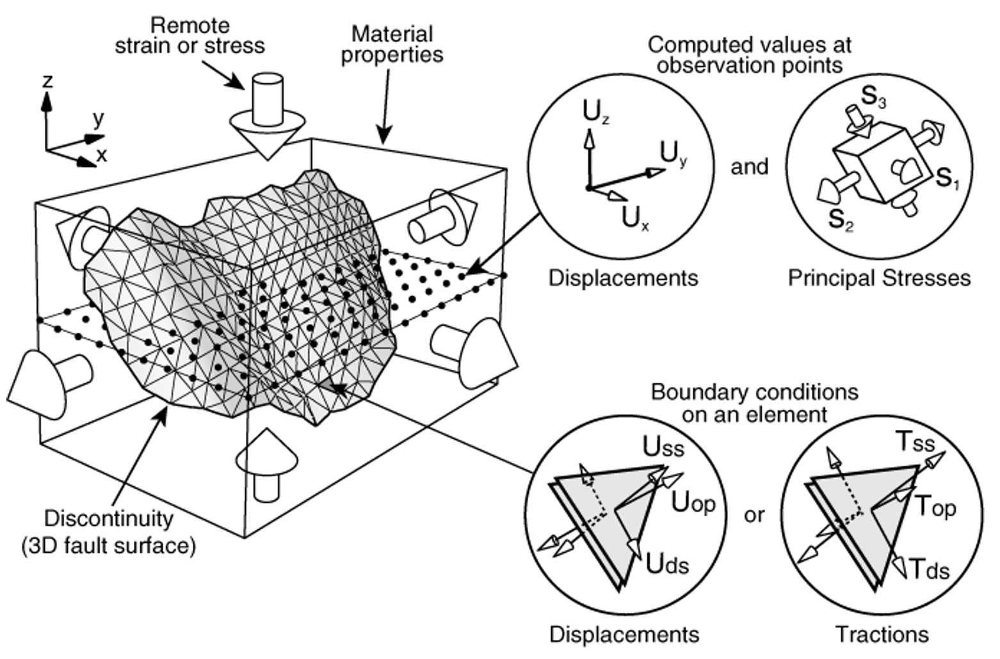
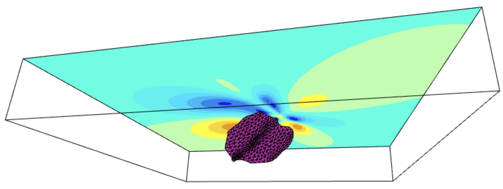

# 
Arch

This is the official documentation of **Arch** for JavaScript and TypeScript.
**Arch** is a displcamenent discontinuity boundary element code developped by [YouWol](https://youwol.com). It is the successor of [**Poly3D**](https://en.wikipedia.org/wiki/David_D._Pollard) and [**iBem3D**](https://www.sciencedirect.com/science/article/pii/S0098300414001496).
  

**Arch** can be run either from the frontend or backend (using [node](https://nodejs.org/en/)).

## Documentation
See the [online](https://youwol.github.io/arch-node-doc/dist/docs/index.html) generated documentation.
  

## Main references
(The generated documentation also includes more references to papers that use this technology)

This [boundary element](https://en.wikipedia.org/wiki/Boundary_element_method) code is based on
___
[Maerten, F., Maerten, L., & Pollard, D. D. (2014). iBem3D, a three-dimensional iterative boundary element method using angular dislocations for modeling geologic structures. Computers & Geosciences, 72, 1-17.](https://www.sciencedirect.com/science/article/pii/S0098300414001496)

with corrections for singular points from

[Nikkhoo, M., & Walter, T. R. (2015). Triangular dislocation: an analytical, artefact-free solution. Geophysical Journal International, 201(2), 1119-1141.](https://academic.oup.com/gji/article/201/2/1119/572006)
___

  

